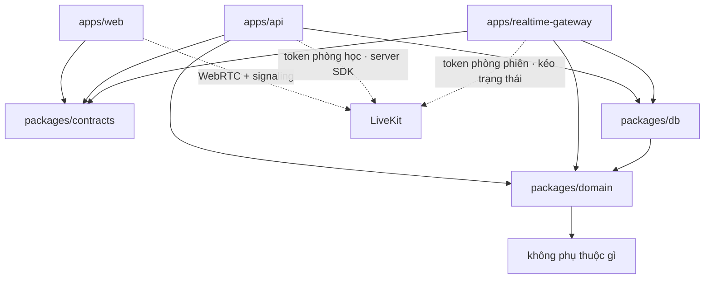
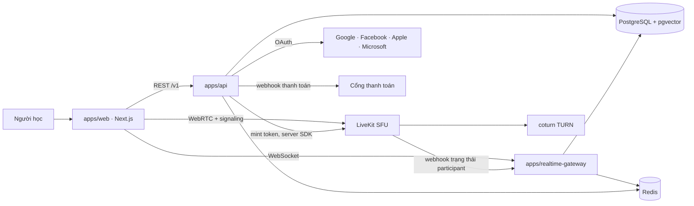
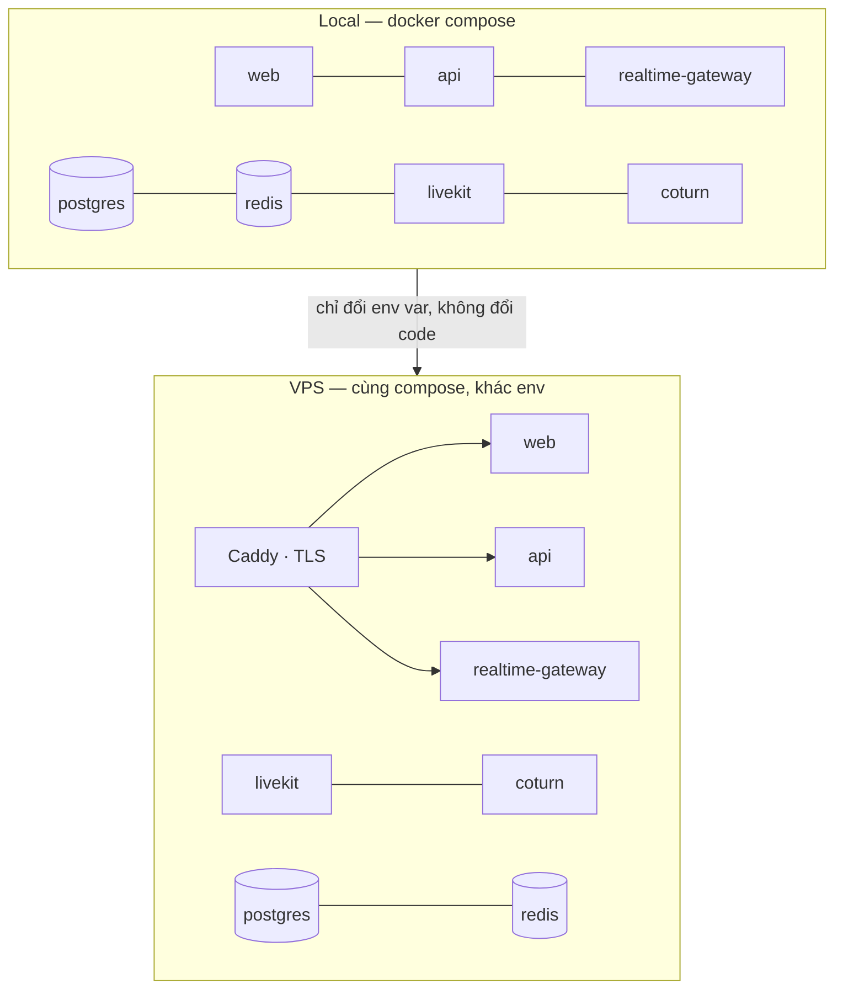
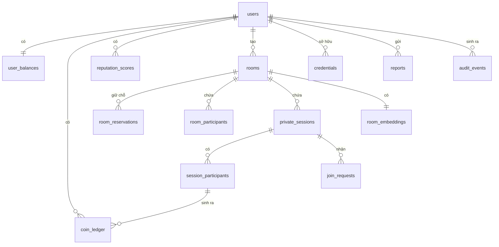

# Architecture Spine — StuWith

## Design Paradigm

**Modular monolith với lõi hexagonal (ports & adapters), triển khai thành hai process.**

`docs/prd.md` US-0.2 AC1 bắt tách **hai process**, không bắt hai codebase. Một monorepo, một lõi domain, hai vỏ chạy:

| Tầng | Thư mục | Vai trò |
| --- | --- | --- |
| Domain (lõi) | `packages/domain` | Luật coin, luật phiên, luật tuổi, luật quyền. Không biết gì về HTTP, DB, LiveKit |
| Hợp đồng | `packages/contracts` | Type + schema của `/v1`, dùng chung web ↔ api ↔ app phone |
| Adapter | `packages/db` | Postgres, migration, repository |
| Vỏ HTTP | `apps/api` | REST `/v1`, OAuth, cấp token phòng học, thu hồi quyền |
| Vỏ realtime | `apps/realtime-gateway` | WebSocket, coin scheduler, vòng đời phiên, cấp token phòng phiên, chat |
| Client | `apps/web` | Next.js |

## Invariants & Rules



### AD-1 — Chiều phụ thuộc chỉ đi vào trong

- **Binds:** all
- **Prevents:** luật trừ coin bị cài hai lần ở `api` và `realtime-gateway` rồi lệch nhau — lệch ở chỗ có tiền
- **Rule:** `packages/domain` không được import từ `apps/*`, `packages/db`, hay bất kỳ SDK hạ tầng nào (LiveKit, Redis, Postgres driver). Mọi luật nghiệp vụ sống ở `domain`; vỏ chỉ dịch vào/ra. Vi phạm chiều này là lỗi build, không phải góp ý review.

### AD-2 — LiveKit là mặt phẳng media, Gateway là mặt phẳng nghiệp vụ

- **Binds:** S1, S2, US-1.3, US-2.3, US-2.4
- **Prevents:** logic có tiền hoặc có hệ quả pháp lý trôi vào đường media, nơi không có transaction, không có audit, và giao hàng chỉ là best-effort
- **Rule:** LiveKit lo signaling + SFU + adaptive stream; client nói chuyện trực tiếp với LiveKit bằng LiveKit SDK. Mọi thứ có **tiền, quyền, hoặc phải ghi audit** đi qua `apps/api` hoặc `apps/realtime-gateway`. **Cấm** dùng LiveKit data channel làm đường truyền cho sự kiện trừ coin, đồng thuận, hay kết quả báo cáo.

### AD-3 — Đồng hồ coin là server-authoritative

- **Binds:** S2, US-2.2, US-2.3, US-2.4
- **Prevents:** client sửa được tự báo "tôi vẫn đang nghe" để không bị ngắt; hoặc client của người **được hỏi** tự báo "vẫn đang nói" để tiền chảy tiếp
- **Rule:** Scheduler trong `apps/realtime-gateway` là nguồn duy nhất phát nhịp trừ coin. Đồng hồ trên màn hình là ảnh phản chiếu, không có quyền quyết định gì.
- **Rule (kéo, không đẩy):** LiveKit khai báo webhook là **best-effort, không bảo đảm giao hàng** — đúng thuộc tính mà AD-2 dùng để loại data channel khỏi đường tiền. Vì vậy webhook chỉ là **gợi ý để phản ứng nhanh**, không phải thẩm quyền. Trước mỗi lần trừ ở ranh giới block, scheduler **kéo** trạng thái thật qua `GetParticipant`/`ListParticipants` của server SDK. Không có block nào được trừ dựa trên một sự kiện đẩy chưa được xác nhận lại.

### AD-4 — Block suy ra tất định, mỗi lần trừ là idempotent

- **Binds:** S2, US-2.2 AC3, US-2.3 AC2/AC6
- **Prevents:** timer trôi hoặc tick chạy lại biến thành sai tiền; và trừ trùng khi scheduler khởi động lại
- **Rule:** `block_index = floor((now − participant.joined_at) / block_size)` — neo theo **thời điểm từng người vào phiên**, không theo `session.started_at`. Neo theo phiên sẽ khiến người vào sau (US-2.4 AC8) bị trừ ngay cho một block dở dang mà giao diện không hiện gì, phá luật "không trừ coin nếu chưa qua thẻ xác nhận". Mỗi lần trừ mang khoá `(session_id, participant_id, block_index)` với ràng buộc `UNIQUE`. Tick chạy lại bị DB từ chối. Timer trôi trở thành **độ trễ**, không thành **sai tiền**.
- **Rule (tạm dừng):** khi một người rơi vào trạng thái `suspended` (mất kết nối, đang trong cửa sổ thử lại 30 giây của `EXPERIENCE.md`), đồng hồ của **riêng người đó** dừng và `joined_at` hiệu dụng được dịch tới khi họ quay lại. Không có block nào được sinh trong lúc suspended — nếu không, cửa sổ thử lại sẽ sinh ra block ma.

### AD-5 — Sổ cái là nguồn sự thật; số dư không bao giờ được ghi trực tiếp

- **Binds:** S2, S4, US-2.2, US-4.2
- **Prevents:** một dev hoặc một agent tương lai viết hàm `setBalance()`; và số dư trôi khỏi audit log mà không ai phát hiện
- **Rule:** Bảng sổ cái append-only là nguồn sự thật; số dư là **cache ghi trong cùng transaction** với dòng sổ cái sinh ra nó. Không tồn tại đường code nào sửa số dư mà không chèn một dòng sổ cái. Bất biến kiểm tra được: `SUM(coin_ledger của một user) == user_balances.balance` — có job đối soát định kỳ.
- **Rule (bảng riêng):** số dư sống ở bảng **`user_balances` riêng**, không phải một cột trong `users`. Lý do: `users` thuộc về `api` (AD-8), nhưng số dư thuộc về `realtime-gateway`. Một lệnh `save(user)` bình thường của ORM ở `api` — cập nhật tuổi, xác minh, đổi gói — sẽ **âm thầm ghi đè** một lần trừ hoặc một giao dịch nạp. Quyền sở hữu của AD-8 tính theo **thực thể**; Postgres tranh chấp theo **hàng**. Tách bảng là cách duy nhất để hai điều đó trùng nhau.

### AD-6 — Không âm bằng câu điều kiện, không bằng đọc-rồi-ghi

- **Binds:** S2, US-2.3 AC4
- **Prevents:** race giữa đọc số dư và ghi số dư khi ba người trừ song song
- **Rule:** Trừ coin luôn dạng `UPDATE user_balances SET balance = balance − :amt WHERE user_id = :u AND balance >= :amt`. Không có đường nào đọc số dư ra rồi tính rồi ghi lại. Không đủ số dư thì câu lệnh không tác động dòng nào, và đó là tín hiệu dừng phiên cho **riêng người đó**.
- **Rule (port):** vì AD-1 đẩy câu lệnh này xuống adapter, port `debit()` trong `packages/domain` phải khai `InsufficientFunds` là **một nhánh trả về bắt buộc xử lý**, không phải exception tuỳ chọn. Mọi adapter (Postgres, in-memory cho test, DB khác sau này) phải qua **một bộ test hợp đồng dùng chung** — nếu không, một adapter quên điều kiện vẫn tuân thủ đủ mọi AD.

### AD-7 — Trừ ở đầu block

- **Binds:** S2, US-2.3 AC2
- **Prevents:** khe hở thoát ở giây cuối của block để né tiền
- **Rule:** Block bắt đầu là trừ ngay. Phiên chỉ tiếp tục sang block kế nếu block đó trừ thành công.

### AD-8 — Mỗi thực thể có đúng một chủ ghi

- **Binds:** all
- **Prevents:** hai process cùng ghi một thực thể rồi ghi đè nhau, và hai định nghĩa vòng đời cho cùng một khái niệm
- **Rule:**

  | Thực thể | Chủ ghi | Bên còn lại |
  | --- | --- | --- |
  | Sổ cái coin (`coin_ledger`), số dư (`user_balances`) | `realtime-gateway` | `api` chỉ đọc |
  | Phiên hỏi riêng (vòng đời, người tham gia) | `realtime-gateway` | `api` chỉ đọc |
  | Tin nhắn chat, trạng thái bận / xin tham gia | `realtime-gateway` | `api` chỉ đọc |
  | Người dùng, hồ sơ, tuổi, xác minh | `api` | `realtime-gateway` chỉ đọc |
  | Phòng, gói dịch vụ, báo cáo | `api` | `realtime-gateway` chỉ đọc |
  | **Hiện diện trong phòng (`room_participants`)** | **`realtime-gateway`** | `api` chỉ đọc khi kiểm trần |
  | Điểm uy tín (`reputation_scores`) | `realtime-gateway` | `api` chỉ đọc |
  | Giữ chỗ vào phòng (`room_reservations`) | `api` (kể cả dọn hết hạn) | `realtime-gateway` chỉ đọc |
  | Token phòng học | `api` | — |
  | Token phòng phiên hỏi riêng | `realtime-gateway` | — |

  Hiện diện thuộc về `realtime-gateway` vì sự thật về "ai đang thật sự trong phòng" đến từ LiveKit, không từ ý định vào phòng.

- **Rule (bảng phủ hết):** bảng chủ ghi ở trên phải phủ **mọi** bảng trong sơ đồ thực thể, không chỉ những bảng dễ nghĩ tới. Một bảng không có chủ là một bảng có hai chủ. Bảng đã gán: `reputation_scores` → `realtime-gateway` (điểm sinh từ hoạt động trong phiên); `audit_events` → **cả hai được ghi, nhưng append-only nên không có tranh chấp** — bù lại hình dạng dòng audit phải khai trong `packages/contracts` để hai process không ghi hai kiểu.
- **Rule (cưỡng chế bằng quyền DB, không bằng lời văn):** mỗi process dùng một DB role riêng. Role của `api` **không có** `INSERT`/`UPDATE` trên `coin_ledger` và `user_balances`; role của `realtime-gateway` **không có** `UPDATE` trên `users`, `rooms`, `plans`. Sở hữu viết trong văn bản là góp ý; sở hữu cưỡng chế bằng `GRANT` là bất biến.

  Nạp coin (US-4.2) là ngoại lệ có kiểm soát: `api` nhận webhook thanh toán nhưng **không tự ghi sổ cái** — nó phát một lệnh ghi có khoá idempotent cho `realtime-gateway`.

### AD-9 — Token vào phòng LiveKit là điểm chốt quyền duy nhất

- **Binds:** S1, S4, US-0.5 AC2, US-1.2 AC3, US-4.1 AC2
- **Prevents:** ba luật chặn khác nhau (tuổi, trần gói, ban) rải rác ở ba chỗ rồi lệch nhau
- **Rule:** Client không bao giờ tự nối vào LiveKit bằng credential tĩnh. Mọi token là JWT **ngắn hạn, riêng cho một lần vào một phòng LiveKit cụ thể**, cấp sau khi kiểm: đã đăng nhập · không bị ban · đủ tuổi cho hành vi đang xin · còn chỗ theo trần. Token không tái sử dụng được giữa các phòng.
- **Rule (ai cấp):** cấp token là một **năng lực của `packages/domain`**, không phải độc quyền của một process. Process nào sở hữu quyết định kết nạp thì process đó cấp: `api` cấp token phòng học (nó sở hữu `rooms`), `realtime-gateway` cấp token phiên hỏi riêng (nó sở hữu `private_sessions`, AD-8/AD-10). Chia như vậy để **không** cần một lời gọi đồng bộ `realtime-gateway → api` chỉ để xin token. Lệnh xuyên process ở các đường khác vẫn tồn tại và đi qua kênh của AD-24.

### AD-10 — Trần phiên hỏi riêng cưỡng chế ở server

- **Binds:** S2, US-2.3 AC5, US-2.4 AC7
- **Prevents:** khung giá 10–500 coin/phút bị vô hiệu hoá bằng cách nhân số người
- **Rule:** Một phiên hỏi riêng tối đa **3 người** (1 người được hỏi + tối đa 2 người trả coin). Trần cưỡng chế trong `realtime-gateway` khi chấp nhận lời xin tham gia, không phải bằng cách ẩn nút ở client.

### AD-11 — Khuôn mặt ẩn không rời máy người dùng

- **Binds:** S2, US-2.1 AC2, NFR Riêng tư
- **Prevents:** một bản cài đặt "tạm thời" gửi khung hình gốc lên server để xử lý filter, rồi ở lại vĩnh viễn
- **Rule:** Ẩn mặt và filter xử lý hoàn toàn ở client trước khi khung hình vào WebRTC track. Server và LiveKit **không bao giờ** nhận được khung hình gốc khi người dùng đang ẩn. Không có endpoint nào nhận ảnh khuôn mặt.

### AD-12 — Audit log append-only cho mọi hành động nhạy cảm

- **Binds:** all, NFR Governance H5, US-0.4 AC3
- **Prevents:** sửa lịch sử sau sự cố; và tranh chấp tiền không có bằng chứng — đặc biệt quan trọng vì MVP không ghi hình
- **Rule:** Đăng nhập, mọi thay đổi số dư, báo cáo, hành động moderation, cấp token phòng đều ghi một dòng append-only. Bảng audit **không có** đường `UPDATE` hay `DELETE` trong code; quyền DB của app không bao gồm hai lệnh đó trên bảng này.

### AD-13 — Hợp đồng `/v1` là một gói code, không phải một quy ước

- **Binds:** all, US-0.2 AC2
- **Prevents:** web và api trôi khỏi nhau, và app phone sau này phải đoán hợp đồng
- **Rule:** Mọi payload qua ranh giới process được khai báo trong `packages/contracts` (schema có kiểm lúc chạy, sinh được OpenAPI). Không có type nào của hợp đồng khai ở `apps/*`. Đổi hợp đồng theo cách phá vỡ tương thích thì phải lên `/v2`, không sửa `/v1` tại chỗ.

### AD-14 — Cấu hình qua biến môi trường, bí mật không nằm trong code

- **Binds:** all, US-0.4 AC1
- **Prevents:** credential lọt vào git, và cấu hình khác nhau giữa local với VPS mà không ai biết
- **Rule:** Mọi cấu hình đọc từ env var, kiểm schema lúc khởi động và **fail fast** nếu thiếu. Không có giá trị mặc định nào cho bí mật. Pipeline có bước quét credential.

### AD-15 — PII không vào log

- **Binds:** all, NFR Bảo mật H4
- **Prevents:** ngày sinh, email, token rò rỉ qua log — thứ không thu hồi được
- **Rule:** Logger có bộ lọc danh sách trắng: chỉ id và trường đã khai được ghi. Ngày sinh (US-0.5 AC5), email, access token, nội dung chat không bao giờ vào log ở bất kỳ mức nào.

### AD-16 — Đóng phòng là giao thức hai bước, không phải một lệnh xoá

- **Binds:** S1, S2, US-1.1, US-2.3
- **Prevents:** `api` đóng phòng trong lúc `realtime-gateway` đang tính coin cho một phiên bên trong — cả hai đều tuân thủ AD-8 mà vẫn hỏng: hoặc trừ coin cho phiên không còn ngữ cảnh, hoặc tick thất bại im lặng và người dùng học miễn phí
- **Rule:** Không tồn tại đường xoá cứng một phòng còn phiên sống. Đóng phòng đi ba nhịp: `api` đặt phòng sang `closing` và ngừng cấp token mới → `realtime-gateway` kết thúc mọi phiên đang chạy, chốt sổ block cuối, báo lại → `api` mới đóng hẳn. Quy tắc chung: **thực thể của một chủ không được biến mất khi thực thể sống của chủ kia đang phụ thuộc vào nó.**

### AD-17 — Đơn giá được chụp ảnh vào phiên

- **Binds:** S2, US-2.3 AC1/AC6, US-2.4 AC8
- **Prevents:** host nâng giá giữa phiên và người đang học bị trừ theo giá mới — phá thẳng luật "không có gì trừ coin mà không qua thẻ xác nhận" của `EXPERIENCE.md`
- **Rule:** Đơn giá ghi vào `session_participants` **tại thời điểm người đó vào phiên**. Mọi lần tính tiền đọc giá từ bản chụp đó, không bao giờ từ hồ sơ hiện tại của host. Host đổi giá chỉ ảnh hưởng phiên mở sau đó. Người vào sau (US-2.4) chụp giá tại lúc vào, không truy thu và không được hưởng giá cũ.

### AD-18 — Quyền phải thu hồi được, không chỉ kiểm lúc cấp

- **Binds:** S1, S2, S3, US-0.5, US-3.4, US-4.1
- **Prevents:** AD-9 kiểm quyền lúc cấp token, nên một người bị ban giữa phiên **vẫn ở trong phòng và vẫn tính tiền** cho tới khi tự thoát — lỗ hổng an toàn, không chỉ lỗ hổng tiền
- **Rule:** Ban, hạ gói, hoặc chặn theo tuổi phải đẩy được lệnh thu hồi tới `realtime-gateway`: kết thúc phiên hỏi riêng của người đó (chốt sổ block đang chạy), rồi đuổi khỏi phòng LiveKit qua server SDK. Token ngắn hạn thu hẹp bề mặt nhưng **không thay thế** thu hồi.
- **Rule (bề mặt lệnh phải tồn tại trong MVP):** việc `docs/prd.md` §7 hoãn *giao diện* moderator **không** hoãn *bề mặt lệnh*. Phải có một endpoint thu hồi có xác thực ngay từ MVP; sửa tay bằng `psql UPDATE` **không tính** — nó bỏ qua đúng đường mà AD này tồn tại để bảo vệ, và người bị ban sẽ tiếp tục kiếm coin giữa phiên. Không có giao diện thì gọi bằng công cụ dòng lệnh, nhưng phải gọi qua endpoint. Endpoint này thuộc **S3**, cùng sprint với US-3.4; chỉ *giao diện* moderator mới hoãn sang sau.

### AD-19 — Không gian khoá idempotent phân theo nguồn

- **Binds:** S2, S4, US-2.2 AC3, US-4.2 AC1
- **Prevents:** khoá của tick phiên và khoá của giao dịch nạp chen nhau trong một không gian, khiến một `UNIQUE` chặn nhầm giao dịch hợp lệ hoặc làm mất tính idempotent của một trong hai
- **Rule:** Mỗi dòng sổ cái mang `source` ∈ {`session_tick`, `topup`, `system_grant`, `reputation_reward`, `refund`} và ràng buộc là `UNIQUE(source, idempotency_key)`. Với `session_tick`, `idempotency_key` sinh tất định từ bộ ba của AD-4. Thêm một `source` mới là thêm một quy tắc sinh khoá, không phải mượn khoá của nguồn khác.

### AD-20 — Cổng chất lượng tối thiểu của pipeline

- **Binds:** all, US-0.4 AC1, NFR Governance H5
- **Prevents:** AD-14 nói "pipeline có bước quét credential" nhưng không AD nào nói pipeline tồn tại ở đâu — Rule trỏ vào hư không, và mỗi người tự dựng một cổng khác nhau
- **Rule:** Mọi merge vào nhánh chính phải qua bốn cổng, chạy trên CI chứ không phải máy cá nhân: **quét credential** · **kiểm chiều phụ thuộc AD-1** · **test hợp đồng adapter của AD-6** · **migration chạy được trên bản sao DB có dữ liệu**. Deploy lên VPS cần một bước duyệt thủ công (H5). Chọn nền tảng CI cụ thể là chuyện hoãn được; bốn cổng này thì không.

### AD-21 — Phiên hỏi riêng là một phòng LiveKit riêng

- **Binds:** S2, US-2.3 AC5, US-2.4
- **Prevents:** spine cũ nói "kênh tách biệt" mà không nói **tách bằng gì** — hai đơn vị sẽ xây hai kiểu: một bên dựng phòng LiveKit thứ hai, một bên lọc subscribe trong cùng phòng. Nếu chọn cùng phòng thì `participant_left` không còn phân biệt được "rời phiên" với "rời phòng", và AD-3 mất tín hiệu liveness — buộc phải quay về tin client, đúng thứ AD-3 tồn tại để cấm
- **Rule:** Mỗi phiên hỏi riêng là **một phòng LiveKit riêng**; người tham gia giữ đồng thời hai kết nối (phòng học + phòng phiên). Cách ly ở US-2.3 AC5 do LiveKit bảo đảm, không do code của ta lọc đúng. `realtime-gateway` cấp token phòng phiên (AD-9), và vòng đời phòng phiên bám đúng vòng đời phiên — đóng phiên là xoá phòng.
- **Rule (mốc tính tiền):** `participant.joined_at` mà AD-4 neo tiền vào là **thời điểm `realtime-gateway` ghi nhận người đó vào phòng phiên**, không phải lúc bấm nút, không phải lúc cấp token, không phải lúc vào phòng học. Một khái niệm "joined" duy nhất cho cả tiền lẫn hiện diện — nếu không, hai đơn vị sẽ đo tiền từ hai mốc khác nhau.
- **Rule (không rò danh tính):** phòng phiên phải cấu hình để người ngoài phiên không truy vấn được danh sách participant — xem AD-27(b). Tách phòng làm cách ly tốt hơn, nhưng cũng tạo ra một chỗ rò mới nếu để mặc định.

### AD-22 — Kiểm trần chỉ là cổng khi bên kiểm cũng giữ chỗ

- **Binds:** S1, S4, US-1.2 AC3, US-4.1 AC2
- **Prevents:** `api` kiểm trần bằng cách **đọc** `room_participants` mà bảng đó do `realtime-gateway` ghi và chỉ ghi khi LiveKit báo — trễ vài giây. 130 người bấm vào cùng lúc đều qua cửa, đều nhận token hợp lệ, và một phòng Campus trần 100 chứa 130 người
- **Rule:** Bên nào cấp token thì bên đó phải **giữ chỗ trong cùng một thao tác nguyên tử** với việc kiểm. `api` sở hữu `room_reservations` **trọn vẹn** — cấp token là một `INSERT` có điều kiện đếm, thất bại thì không có token. Chỗ giữ có TTL ngắn và **chính `api`** dọn khi hết hạn; `realtime-gateway` chỉ **đọc** hiện diện thật và phát một sự kiện qua AD-24 nếu thấy lệch, không bao giờ ghi vào bảng của `api`. Quy tắc chung: **một phép kiểm chỉ đọc là gợi ý, không phải cổng.**

### AD-23 — Phiên có máy trạng thái tường minh, gồm `suspended`

- **Binds:** S2, US-2.3, US-2.4
- **Prevents:** cửa sổ thử lại 30 giây mà `EXPERIENCE.md` yêu cầu không có chỗ đứng trong mô hình — scheduler sẽ hoặc tiếp tục sinh block ma cho người đã rớt, hoặc kết thúc phiên ngay lập tức, và hai đơn vị sẽ chọn hai hướng khác nhau
- **Rule:** Phiên và từng người trong phiên có trạng thái tường minh: `pending → active → suspended → active | ended`. `suspended` là trạng thái **có thật, có ghi**, không phải khoảng trống giữa hai sự kiện. Chỉ `active` mới sinh block. Chuyển sang `ended` luôn kèm chốt sổ, kể cả khi tới từ `suspended` hết hạn.

### AD-24 — Lệnh xuyên process đi qua một kênh bền, không qua lời gọi trực tiếp

- **Binds:** all, US-4.2, US-3.4, US-1.1
- **Prevents:** spine loại webhook và data channel khỏi đường tiền **vì chúng best-effort**, rồi để ngỏ đúng con đường mang lệnh nạp coin và lệnh ban. Bốn chỗ cần lệnh xuyên process — nạp coin, thu hồi quyền, đóng phòng, báo lệch chỗ giữ — sẽ được hai đơn vị cài bốn kiểu, và ít nhất một kiểu sẽ mất lệnh
- **Rule:** Mọi lệnh giữa hai process đi qua **một kênh bền duy nhất**: bên phát ghi lệnh vào bảng outbox **trong cùng transaction** với thay đổi nghiệp vụ sinh ra nó; bên nhận tiêu thụ, xử lý **idempotent theo khoá lệnh** (AD-19), và đánh dấu đã xử lý. Không có lời gọi HTTP đồng bộ nào giữa `api` và `realtime-gateway` cho việc có hệ quả tiền hoặc quyền. Bên phát sở hữu bảng outbox của mình; bên nhận chỉ đọc và ghi bảng đánh dấu của riêng nó.

### AD-25 — Ranh giới WebSocket được xác thực và giới hạn nhịp như mọi ranh giới khác

- **Binds:** S1, S2, US-0.1 AC3, US-1.4 AC1, NFR Chống tấn công
- **Prevents:** `realtime-gateway` là mặt phẳng có tiền chạy qua, nhưng spine chỉ nói về auth của `api`. Một đơn vị sẽ cho rằng "đã qua `api` rồi thì WebSocket tin được", và mở một cửa không xác thực vào chính chỗ có đồng hồ tiền
- **Rule:** Mỗi kết nối WebSocket phải xác thực **ngay khi bắt tay** bằng chính session của `api`, và **xác thực lại** khi phiên đăng nhập bị thu hồi (AD-18) chứ không giữ mãi tới khi client tự ngắt. Giới hạn nhịp áp ở cả hai ranh giới: theo IP và theo user, tính riêng cho hành vi tốn kém (mở phiên, xin tham gia, gửi chat). Vượt ngưỡng trả về đếm ngược, không trả lỗi kỹ thuật (`EXPERIENCE.md`).

### AD-26 — Mọi input của người dùng đi vào AI phải qua một cửa duy nhất

- **Binds:** S3, US-0.4 AC2, US-3.1 AC3, NFR Bảo mật H4
- **Prevents:** `docs/prd.md` yêu cầu tường minh prompt-injection scan, nhưng spine chưa đặt nó ở đâu. Mỗi chỗ gọi AI sẽ tự quét theo cách riêng, hoặc quên quét
- **Rule:** Không có đường nào gọi model từ `apps/*`. Mọi lời gọi đi qua **một adapter AI duy nhất** trong `packages/db`-tier, và adapter đó chạy prompt-injection scan trước khi gửi, ghi audit mỗi lần gọi (AD-12), và áp timeout. Nguyện vọng người dùng (US-3.1) là input không tin được, kể cả khi chỉ dùng để sinh embedding.

### AD-27 — Payload không được để suy ra thứ giao diện đang giấu

- **Binds:** S2, US-2.4 AC6, NFR Riêng tư
- **Prevents:** `EXPERIENCE.md` cấm tiết lộ *đang hỏi riêng với ai* và *còn bao lâu* (vì thời gian còn lại ÷ đơn giá ⇒ số dư). Nhưng cấm ở tầng giao diện là vô nghĩa nếu API vẫn trả dữ liệu đó. **AD-21 làm việc này nặng thêm:** danh sách participant của phòng LiveKit phiên hỏi riêng *chính là* câu trả lời cho "đang hỏi riêng với ai"
- **Rule:** Ba luật cụ thể. **(a)** Payload trạng thái bận chỉ mang cờ `busy`, không mang định danh đối phương và không mang thời gian còn lại. **(b)** Token phòng phiên (AD-21) phải cấp với quyền che danh tính participant khác — người ngoài phiên không bao giờ nhận được danh sách participant của phòng đó. **(c)** Số dư và thời gian còn lại chỉ trả về cho **chính chủ**; không endpoint nào trả hai trường đó cho người thứ hai, kể cả trong cùng một phiên.

### AD-28 — Người được hỏi tắt mic thì đồng hồ dừng

- **Binds:** S2, US-2.3, US-2.4
- **Prevents:** LiveKit **không có** webhook `track_muted` — mute là sự kiện client-side. Một scheduler chỉ nghe webhook sẽ tiếp tục trừ tiền suốt lúc người được hỏi im lặng, và người trả tiền không có cách nào biết
- **Rule:** Điều kiện tính tiền của một block gồm cả **người được hỏi đang có audio track published và không mute**. Trạng thái mute lấy bằng cách **kéo** `GetParticipant` ở ranh giới block (AD-3), không bằng sự kiện đẩy. Đánh giá **chỉ tại ranh giới block**, không liên tục: nếu tại thời điểm một block sắp bắt đầu mà người được hỏi đang mute, block đó **không được trừ** và người trả rơi vào `suspended` (AD-23) cho tới ranh giới block kế. Người *hỏi* mute thì không ảnh hưởng gì — họ đang nghe.
- **Rule (hiển thị):** khi đồng hồ dừng vì lý do này, giao diện phải nói ra lý do; một đồng hồ đứng im không giải thích đọc như hỏng.

### AD-29 — Bằng chứng KYC không bao giờ chạm hạ tầng của ta

- **Binds:** S3, US-3.4 AC1, NFR Riêng tư
- **Prevents:** xác minh danh tính cần ảnh giấy tờ, nhưng stack MVP không có object store (`docs/prd.md` A-1) — một đơn vị sẽ hoặc dựng lén chỗ lưu, hoặc nhét base64 vào Postgres, và cả hai đều tạo ra một kho PII không ai định tạo
- **Rule:** Xác minh danh tính chạy hoàn toàn qua **nhà cung cấp bên thứ ba**. Ảnh giấy tờ đi thẳng từ trình duyệt người dùng tới nhà cung cấp, **không qua server của ta**. Ta chỉ lưu: mã tham chiếu của nhà cung cấp, kết quả (đạt/không), mốc thời gian, và các trường suy ra được phép dùng (đủ 18 hay chưa, loại huy hiệu được cấp). **Không có endpoint nào nhận tệp** — cùng tinh thần với AD-11.

## Consistency Conventions

| Concern | Convention |
| --- | --- |
| Naming — thư mục & module | kebab-case cho thư mục; module NestJS đặt theo danh từ miền của `docs/prd.md` §8 Glossary (`private-session`, không phải `chat-1v1`) |
| Naming — bảng DB | snake_case, số nhiều: `users`, `rooms`, `private_sessions`, `coin_ledger`, `audit_events` |
| Naming — sự kiện | `<danh-từ>.<động-từ quá khứ>`: `private_session.started`, `coin.debited`, `join_request.accepted` |
| ID | UUIDv7 cho mọi khoá chính — sắp xếp được theo thời gian, không lộ số lượng như số tự tăng |
| Thời gian | Lưu `timestamptz`, luôn UTC. Client tự đổi múi giờ. Không lưu thời gian dạng chuỗi |
| Tiền | Coin là **số nguyên**, đơn vị là 1 coin. Không dùng số thực ở bất kỳ đâu trong đường tiền |
| Hình dạng lỗi | Một envelope duy nhất: `{ error: { code, message, details? } }`. `code` là hằng máy đọc; `message` đã i18n cho người đọc. Không bao giờ đẩy stack trace hay mã lỗi provider ra client (`docs/prd.md` US-0.1 AC4) |
| i18n | Mọi chuỗi hiển thị qua khoá i18n, VI mặc định + EN. Khoá lấy từ `EXPERIENCE.md § Microcopy` khi đã có (`busy.*`, `join.*`) |
| Mutation | Mọi lệnh ghi có hệ quả tiền hoặc quyền đều mang khoá idempotent do bên gọi cung cấp |
| Auth | Web dùng session cookie httpOnly + secure. Token LiveKit là JWT ngắn hạn riêng cho một lần vào phòng (AD-9) |
| Logging | JSON có cấu trúc, một dòng một sự kiện, có `request_id` xuyên suốt hai process. Lọc PII theo AD-15 |
| Migration | Chỉ tiến, không lùi. Mỗi migration chạy được trên DB đang có dữ liệu mà không khoá bảng lâu |
| Tương thích `/v1` | Thêm trường **tuỳ chọn** là tương thích. Đổi tên, đổi kiểu, bỏ trường, hoặc siết ràng buộc là **phá vỡ** và phải lên `/v2` (AD-13) |

## Stack

Đã kiểm trên web ngày 20/08/2026.

| Name | Version |
| --- | --- |
| TypeScript | **7.0.2 cho typecheck + web, `@typescript/typescript6@6.0.2` cho `nest build`** — TS 7.0 không có compiler API lập trình được, nên `nest build` và plugin Swagger/GraphQL gãy dưới TS 7 |
| Next.js | 16.3.0 |
| NestJS | 11.2.1 (adapter Fastify v5) |
| PostgreSQL | 18 (18.6 hiện hành; 19 đang beta — không nâng vội) |
| pgvector | 0.8.6 |
| Valkey | 9.0.4 (BSD-3-Clause) |
| LiveKit server | 1.13.5 (31/07/2026) |
| coturn | upstream 4.13.1; bản distro thường trễ hơn — ghim bản cụ thể khi dựng compose |
| Caddy | 2.11.4 (TLS ở edge) |

## Structural Seed

### Bối cảnh hệ thống



### Triển khai & môi trường



Hai môi trường, cùng một `docker-compose` + file env khác nhau. TLS kết thúc ở edge; LiveKit và coturn cần cổng UDP mở nên nằm ngoài reverse proxy. **coturn là bắt buộc, không phải tuỳ chọn** — WebRTC qua Internet thật gần như luôn cần TURN.

### Thực thể lõi



`room_embeddings` giữ vector mô tả lớp cho US-3.1 (pgvector). `credentials` là huy hiệu học vấn đã xác minh — chỉ có dòng khi đã xác minh, không có trạng thái "chờ duyệt" hiển thị công khai.

### Cây nguồn

```text
stuwith/
  apps/
    web/                  # Next.js 16.3 — client thuần
    api/                  # NestJS HTTP — REST /v1, OAuth, cấp token LiveKit
    realtime-gateway/     # NestJS WS — coin scheduler, phiên, chat, presence
  packages/
    domain/               # luật coin, phiên, tuổi, quyền — không import hạ tầng
    contracts/            # schema + type của /v1, sinh OpenAPI
    db/                   # Postgres adapter, migration, repository
    config/               # đọc + kiểm env var, fail fast
  infra/
    docker-compose.yml    # postgres, redis, livekit, coturn
    livekit.yaml
```

## Capability → Architecture Map

| Capability / Area | Lives in | Governed by |
| --- | --- | --- |
| US-0.1 OAuth 4 provider | `apps/api` | AD-9, AD-14, AD-15 |
| US-0.2 Tách API + Realtime | `apps/api`, `apps/realtime-gateway` | Paradigm, AD-1, AD-13 |
| US-0.3 Design system | `apps/web` | `DESIGN.md` (spine riêng) |
| US-0.4 Nền tảng CASAN | toàn hệ | AD-12, AD-14, AD-15 |
| US-0.5 Khai tuổi & chặn hành vi | `packages/domain`, `apps/api` | AD-9, AD-15 |
| US-1.1 / 1.2 Tạo & join phòng | `apps/api` | AD-8, AD-9 |
| US-1.3 Audio/video mạng yếu | LiveKit + `apps/web` | AD-2 |
| US-1.4 Chat cả phòng | `apps/realtime-gateway` | AD-2, AD-8 |
| US-2.1 Chế độ khuôn mặt | `apps/web` | **AD-11** |
| US-2.2 Ví coin | `packages/domain`, `apps/realtime-gateway` | AD-5, AD-6, AD-12 |
| US-2.3 Hỏi riêng tính coin | `packages/domain`, `apps/realtime-gateway` | AD-3, AD-4, AD-5, AD-6, AD-7, AD-10 |
| US-2.4 Xin tham gia phiên | `apps/realtime-gateway` | AD-8, AD-10 |
| US-3.1 AI match | `apps/api` + pgvector | AD-13 |
| US-3.2 / 3.3 Uy tín & huy hiệu | `packages/domain`, `apps/api` | AD-8, AD-12 |
| US-3.4 Xác minh & báo cáo | `apps/api` | AD-8, AD-12 |
| US-4.1 Gói dịch vụ | `apps/api` | AD-9 |
| US-4.2 Nạp coin | `apps/api` → `apps/realtime-gateway` | AD-5, AD-8 |

## Deferred

| Hoãn | Vì sao có thể chờ |
| --- | --- |
| Multi-region, autoscale, tách microservice thật | Một VPS phục vụ được quy mô bản thử. Ranh giới module ở AD-1 và AD-8 đã cho phép tách sau mà không viết lại |
| Chọn cổng thanh toán cụ thể (Stripe / VNPay / Momo) | Chỉ chạm `apps/api`; AD-8 đã cô lập nó khỏi sổ cái. Phụ thuộc pháp nhân và tài khoản merchant |
| Chọn nhà cung cấp embedding cho US-3.1 | AD-8 cô lập nó khỏi phần còn lại. **Lưu ý:** cột `vector(n)` cố định **số chiều**, nên đổi sang model khác số chiều **là** một migration cộng sinh lại toàn bộ vector — hoãn được, nhưng không miễn phí như nghe |
| Chiến lược sao lưu & khôi phục | Chưa có dữ liệu người dùng thật. Phải quyết **trước** khi mở cho người ngoài, vì sổ cái coin là bản ghi tài chính |
| Nền tảng CI cụ thể và framework test | Bốn cổng chất lượng đã cố định ở AD-20; chọn công cụ nào chạy chúng là chuyện đổi được. **Không hoãn được:** `packages/domain` phải test được mà không cần DB hay mạng — đó là lý do thật của AD-1, không phải thẩm mỹ — và mọi adapter phải qua bộ test hợp đồng chung của AD-6 |
| Metric, trace, cảnh báo | Convention logging đã có; tầng quan trắc đầy đủ chờ tới khi có người dùng thật để biết cần đo gì. **Không hoãn được:** coin scheduler phải phát health signal ngay từ đầu — một đồng hồ tiền chết âm thầm là chế độ hỏng tệ nhất của hệ thống này, và `docs/prd.md` §1.5 đã định nghĩa sẵn counter-metric cần đo |
| Giao diện moderator | `docs/prd.md` §7 đã hoãn có chủ đích; AD-12 bảo đảm dữ liệu vẫn được ghi để sau này dựng giao diện lên trên |
| Ghi hình buổi học | Đã gỡ khỏi MVP. Khi quay lại sẽ cần thêm recorder + object store + luồng đồng thuận — không phải thay đổi nhỏ |
| Ngưỡng cụ thể của lưới dày Campus 45–100 | Cần đo trên thiết bị thật; là quyết định của client, không phải của spine |
